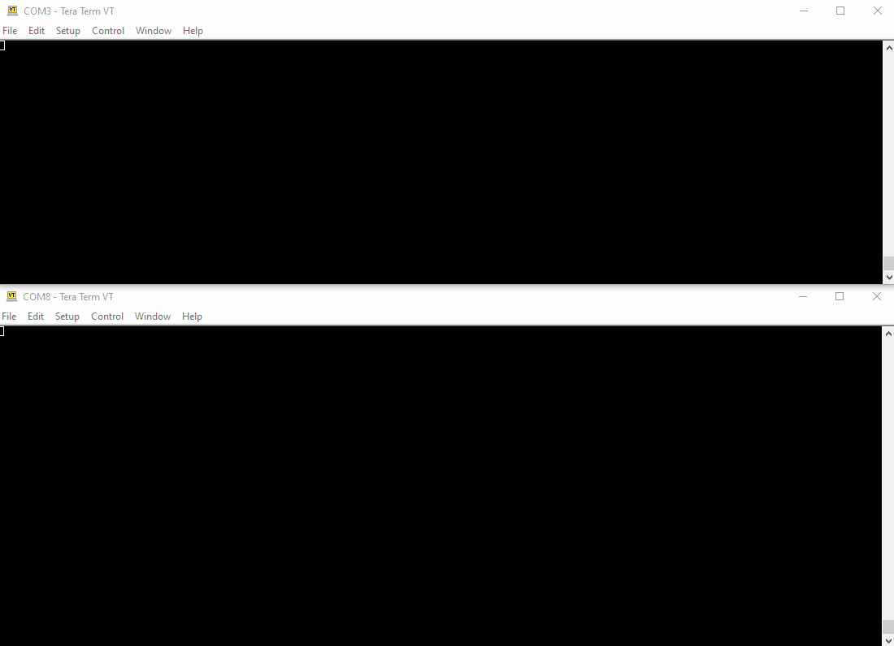

# FPGA Partial Reconfiguration Demo Using ICAP

## About
This project is a demonstration of partial reconfiguration on a Xilinx FPGA using the Internal Configuration Access Port (ICAP). It is an adaptation of a Xilinx demo project for the [AXI HW ICAP interface](https://www.xilinx.com/products/intellectual-property/axi_hwicap.html#overview), with a Soft Error Mitigation (SEM) controller added and an ICAP arbitration mechanism (the [Arbiter](https://youtu.be/82NUo0PNsrI)). 

This project was developed in Vivado 2020.2, written in VHDL, and programmed in the Vitis IDE.

## Installation
To run the program on a Xilinx [Basys 3](https://reference.digilentinc.com/reference/programmable-logic/basys-3/start) board, the following steps are required:

1. Clone the repo to your computer. The shorter the file path, the better.
2. Open the program in Vivado 2020.2 or later. If the program requires the IPs to be upgraded, use the `upgrade_ip[ get_ips ]` command.
3. Open the Vivado Hardware Manager, plug in the Basys 3 board, and open a connection to the device.
4. Plug the LED PMOD into slot JB and the USB/UART PMOD into the lower half of slot JC.
5. Open Tera Term and open two connections to the serial ports.
	* Baud Rate 9600
	* 8-bit data
	* No parity
	* 1 stop bit
	* New-Line for Receive: CR+LF
7. Program the FPGA with the bitstream
8. Run the demo from Tera Term.

## Hierarchy

## Other Notes

